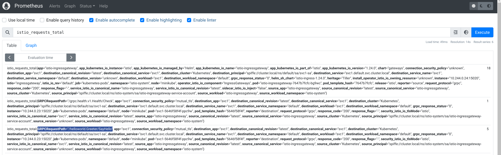

## gRPC per method observability with envoy and Istio


This repo is a simple tutorial on how to setup envoy and istio such that _per method_ statistics are emitted to prometheus+grafana.

Both istio and envoy have robust metric monitoring capability but the default granularity for these are at the [service level](https://istio.io/latest/docs/concepts/observability/#service-level-metrics).  If you needed resolution at the method you would need to some further configuration settings if using envoy or istio:

- [Envoy gRPC Statistics filter](https://www.envoyproxy.io/docs/envoy/latest/configuration/http/http_filters/grpc_stats_filter) (`envoy.filters.http.grpc_stats`)
- [Istio wasm telemetry](https://istio.io/latest/docs/reference/config/proxy_extensions/wasm_telemetry/)


This repo walks you through a sample setup for both standalone envoy and istio where the count of a specific method call (`/helloworld.Greeter/SayHello`) is emitted and collected via prometheus and subsequently rendered in grafana.

You can either test this with envoy or istio but the mechanism is a bit different

## Envoy

With envoy, we will use the built in `envoy.filters.http.grpc_stats` filter.

### Start Envoy 1.17

First get envoy.  We are using a pretty recent version (as of end of 2020).

```bash
docker cp `docker create envoyproxy/envoy-dev:latest`:/usr/local/bin/envoy .
```

start envoy

```bash
cd envoy/
./envoy -c server.yaml
```

Notice we configured the filter to emit everything:

```yaml
          http_filters:
          - name: envoy.filters.http.grpc_stats
            typed_config:
              "@type": type.googleapis.com/envoy.extensions.filters.http.grpc_stats.v3.FilterConfig
              stats_for_all_methods: true
              enable_upstream_stats: true                            
          - name: envoy.filters.http.router
```

### Start GRPC Server

Now start the gRPC server

```bash
cd app/
go run greeter_server/main.go
```

The server will by default listen in on `:50051`


## Start Prometheus

Start a local instance of prometheus that interrogates envoy:

```bash
cd envoy/
docker run \
    --net=host \
    -p 9090:9090 \
    -v `pwd`/prometheus/prometheus.yml:/etc/prometheus/prometheus.yml \
    prom/prometheus
```

Ensure Prometheus Target (i.e, envoy) are up:  [http://localhost:9090/targets](http://localhost:9090/targets)


then verify envoy is emitting stats:


### Start Grafana

Start grafana 

```bash
docker run --net=host -p 3000:3000 grafana/grafana 
```

Configure grafana for a [prometheus datasource](https://prometheus.io/docs/visualization/grafana/#creating-a-prometheus-data-source)

```
 http://localhost:3000  admin/admin
 configuration=>datasources
   Select `Prometheus`
    Name: `envoy`
    URL: `http://localhost:9090/`
```


### Grpc Client

Run gRPC client. 

```bash
go run greeter_client/main.go  --host localhost:8080
```

The gRPC client will make several different types of API calls:

-  `rpc SayHello (HelloRequest) returns (HelloReply) {}`   Unary
-  `rpc SayHelloClientStream(stream HelloRequest) returns (HelloReply) {}` Client Stream
-  `rpc SayHelloServerStream(HelloRequest) returns (stream HelloReply) {}` Server Stream   
-  `rpc SayHelloBiDiStream(stream HelloRequest) returns (stream HelloReply) {}` Bidirectional Stream


(you can put this command in a loop,eg 6 times)

### Observe

Prometheus will begin collecting all the metrics from envoy at this point.  The specific one we are interested in is just `SayHello` API method call.

#### Envoy

You can view the prometheus endpoint directly on envoy and see the stats:
Envoy:  [http://localhost:9000/stats/prometheus](http://localhost:9000/stats/prometheus)

`envoy_cluster_grpc_Greeter_0{envoy_grpc_bridge_method="SayHello",envoy_grpc_bridge_service="helloworld",envoy_cluster_name="service_grpc"}`


#### Prometheus

Similarly, on the Prometheus dashboard, see the gRPC Statistics (eg, number `SayHello` invocations)

In our case, if you invoked the client 6 times, you'll see that count:

```log
# TYPE envoy_cluster_grpc_Greeter_0 counter
envoy_cluster_grpc_Greeter_0{envoy_grpc_bridge_method="SayHello",envoy_grpc_bridge_service="helloworld",envoy_cluster_name="service_grpc"} 6
envoy_cluster_grpc_Greeter_0{envoy_grpc_bridge_method="SayHelloBiDiStream",envoy_grpc_bridge_service="helloworld",envoy_cluster_name="service_grpc"} 6
envoy_cluster_grpc_Greeter_0{envoy_grpc_bridge_method="SayHelloClientStream",envoy_grpc_bridge_service="helloworld",envoy_cluster_name="service_grpc"} 6
envoy_cluster_grpc_Greeter_0{envoy_grpc_bridge_method="SayHelloServerStream",envoy_grpc_bridge_service="helloworld",envoy_cluster_name="service_grpc"} 6
```

#### Grafana

Finally, create a dashboard for the invocation counts

Use the same metric as above (i.,e invocation count)


### Istio

The istio configuration is a bit different.  It uses a specific wasm stats filter as described here

- [Classifying Metrics Based on Request or Response](https://istio.io/latest/docs/tasks/observability/metrics/classify-metrics/#classify-metrics-by-request)


#### Create GKE cluster and install istio 1.8

Create an istio cluster (we are using GKE)

```bash
cd istio/

gcloud container  clusters create cluster-1 --machine-type "n1-standard-2" --zone us-central1-a  --num-nodes 4 --enable-ip-alias \
  --cluster-version "1.19" -q

gcloud container clusters get-credentials cluster-1 --zone us-central1-a

kubectl create clusterrolebinding cluster-admin-binding --clusterrole=cluster-admin --user=$(gcloud config get-value core/account)

kubectl create ns istio-system

export ISTIO_VERSION=1.8.0

wget https://github.com/istio/istio/releases/download/$ISTIO_VERSION/istio-$ISTIO_VERSION-linux-amd64.tar.gz
tar xvf istio-$ISTIO_VERSION-linux-amd64.tar.gz
rm istio-$ISTIO_VERSION-linux-amd64.tar.gz

export PATH=`pwd`/istio-$ISTIO_VERSION/bin:$PATH

istioctl install --set profile=preview \
 --set meshConfig.enableAutoMtls=true  \
 --set values.gateways.istio-ingressgateway.runAsRoot=true 

kubectl apply -f https://raw.githubusercontent.com/istio/istio/release-1.8/samples/addons/prometheus.yaml
kubectl apply -f https://raw.githubusercontent.com/istio/istio/release-1.8/samples/addons/grafana.yaml

kubectl get no,po,rc,svc,ing,deployment -n istio-system 

kubectl label namespace default istio-injection=enabled
```

(wait a couple of mins)

- Open up several new shell windows and type in one line into each:

```bash
kubectl -n istio-system port-forward $(kubectl -n istio-system get pod -l app=grafana -o jsonpath='{.items[0].metadata.name}') 3000:3000

kubectl port-forward -n istio-system $(kubectl get pod -n istio-system -l app=prometheus -o jsonpath='{.items[0].metadata.name}') 9090:9090
```

Open up browser windows to each

Open up a browsers tabs and go to:

- `Grafana`: [http://localhost:3000/dashboard/db/istio-mesh-dashboard](http://localhost:3000/dashboard/db/istio-mesh-dashboard)
- `Prometheus`: [http://localhost:9090/targets](http://localhost:9090/targets)


- Find the gatewayIP

```bash
$ kubectl get svc istio-ingressgateway -n istio-system

export GATEWAY_IP=$(kubectl -n istio-system get service istio-ingressgateway -o jsonpath='{.status.loadBalancer.ingress[0].ip}')
echo $GATEWAY_IP
```

#### Deploy gRPC Server 

```bash
kubectl apply -f istio-deployment.yaml -f istio-svc1.yaml -f istio-ingress-gateway.yaml
```

(optional) If you want, enable wasm proxy debugging:

```bash
kubectl port-forward -n default deployment/svc1 15000
curl -XPOST "localhost:15000/logging?wasm=trace"
```

and look at the logs on the service itself

```bash
$ kubectl get po
NAME                    READY   STATUS    RESTARTS   AGE
svc1-7d64d798fb-j9xh7   2/2     Running   0          57s

$ kubectl logs svc1-7d64d798fb-j9xh7 -c istio-proxy
```


#### Test gRPC Client

Now test that the basic istio/grpc app is accessible before we enable stats:

```bash
cd app/

$ go run greeter_client/main.go --host $GATEWAY_IP:80
        2020/12/30 12:33:11 RPC HealthChekStatus:SERVING
        2020/12/30 12:33:11 Unary Request Response:  Hello world  --> 16f5314c-4ac5-11eb-8c55-760e4197937a 
        2020/12/30 12:33:12  Got SayHelloClientStream  [SayHelloClientStream  Response]
        2020/12/30 12:33:12 Message: [SayHelloServerStream Response]
        2020/12/30 12:33:12 Message: [SayHelloServerStream Response]
        2020/12/30 12:33:12 Message: [SayHelloServerStream Response]
        2020/12/30 12:33:12 Message: [SayHelloServerStream Response]
        2020/12/30 12:33:12 Message: [SayHelloServerStream Response]
        2020/12/30 12:33:12 Stream Trailer:  map[]
        2020/12/30 12:33:12 Response: [SayHelloBiDiStream Server Response] 
        2020/12/30 12:33:12 Response: [SayHelloBiDiStream Server Response] 
        2020/12/30 12:33:12 Response: [SayHelloBiDiStream Server Response] 
        2020/12/30 12:33:12 Response: [SayHelloBiDiStream Server Response] 
        2020/12/30 12:33:12 Response: [SayHelloBiDiStream Server Response] 
        2020/12/30 12:33:12 Response: [SayHelloBiDiStream Server Response] 
        2020/12/30 12:33:12 Response: [SayHelloBiDiStream Server Response] 
        2020/12/30 12:33:12 Response: [SayHelloBiDiStream Server Response] 
        2020/12/30 12:33:12 Response: [SayHelloBiDiStream Server Response] 
        2020/12/30 12:33:12 Response: [SayHelloBiDiStream Server Response]
```

#### Enable metrics

Now enable the stats.  The CEL rule below will emit a counter everytime the request method shown below is invoked.  We are using a standard envoy request [url attribute](https://www.envoyproxy.io/docs/envoy/latest/intro/arch_overview/advanced/attributes#arch-overview-request-attributes) in the rule below

```json
{
    "value": "SayHello",
    "condition": "request.path == '/helloworld.Greeter/SayHello' && request.method == 'POST'"
}
```


Apply the attribute rule:

```bash
kubectl -n istio-system apply -f attribute_gen_service.yaml
```

Now extract the stats filter

```
kubectl -n istio-system get envoyfilter stats-filter-1.8 -o yaml > stats-filter-1.8.yaml
```

Edit `stats-filter-1.8.yaml`

and define the rule shown below under the `context: SIDECAR_INBOUND` section.
(btw, the istio docs has incorrect indents shown...)

```yaml
  - applyTo: HTTP_FILTER
    match:
      context: SIDECAR_INBOUND
      listener:
        filterChain:
          filter:
            name: envoy.http_connection_manager
            subFilter:
              name: envoy.router
      proxy:
        proxyVersion: ^1\.8.*
    patch:
      operation: INSERT_BEFORE
      value:
        name: istio.stats
        typed_config:
          '@type': type.googleapis.com/udpa.type.v1.TypedStruct
          type_url: type.googleapis.com/envoy.extensions.filters.http.wasm.v3.Wasm
          value:
            config:
              configuration:
                '@type': type.googleapis.com/google.protobuf.StringValue
                value: |
                  {
                    "metrics": [
                      {
                        "name": "requests_total",
                        "dimensions": {
                          "request_operation": "istio_operationId"
                        }
                      }
                    ]
                  }
              root_id: stats_inbound
              vm_config:
                allow_precompiled: true
                code:
                  local:
                    filename: /etc/istio/extensions/stats-filter.compiled.wasm
                runtime: envoy.wasm.runtime.v8
                vm_id: stats_inbound

```

Apply

```bash
kubectl apply -n istio-system -f stats-filter-1.8.yaml
```

#### Send more grpc Requests

For examle 6 more requests

```bash
go run greeter_client/main.go --host $GATEWAY_IP:80
```

#### View Prometheus

You should now see the prometheus stats now under `istio_requests_total` that emits the label `request_operation` with value `SayHello` 
```log
istio_requests_total{app="svc1",connection_security_policy="mutual_tls",destination_app="svc1",destination_canonical_revision="latest",destination_canonical_service="svc1",destination_principal="spiffe://cluster.local/ns/default/sa/svc1-sa",destination_service="svc1.default.svc.cluster.local",destination_service_name="svc1",destination_service_namespace="default",destination_version="unknown",destination_workload="svc1",destination_workload_namespace="default",grpc_response_status="0",instance="10.0.1.6:15020",istio_io_rev="default",job="kubernetes-pods",kubernetes_namespace="default",kubernetes_pod_name="svc1-7d64d798fb-j9xh7",pod_template_hash="7d64d798fb",reporter="destination",request_operation="SayHello",request_protocol="grpc",response_code="200",response_flags="-",security_istio_io_tlsMode="istio",service_istio_io_canonical_name="svc1",service_istio_io_canonical_revision="latest",source_app="istio-ingressgateway",source_canonical_revision="latest",source_canonical_service="istio-ingressgateway",source_principal="spiffe://cluster.local/ns/istio-system/sa/istio-ingressgateway-service-account",source_version="unknown",source_workload="istio-ingressgateway",source_workload_namespace="istio-system"}
```

which you can see in prometheus console (note the count is 6 per the number of invocations)



#### View Grafana

The same stat on grafana too


---

This repo is just a tutorial on fine-grain observability with istio and envoy